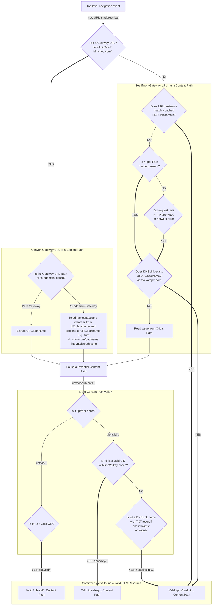

# Implementation Notes for Browsers and URI parsers

Below is the suggested heuristic for detecting content-addressed resources
on the web, and presenting additional user interface for interacting with them.

TBD if this document  will live in this repo, https://docs.ipfs.tech or become part of https://github.com/ipfs/specs/

## Detecting IPFS Resources and Hints

## What to do with detected Content Paths?

### Immutable `/ipfs/cid/..`

- Display "Open via IPFS" button in UI
  - Clicking it should open `ipfs://cid/path?query#hash` (preserving any `?query` or `#hash` from the original HTTP URL)
- If IPFS Gateway Redirect is enabled, and the HTTP URL was a gateway one, redirect automatically to `ipns://dnslink/path?query#hash`

### Mutable `/ipns/key/..`
- Display "Open via IPFS" button in UI
  - Clicking it should open `ipns://key/path?query#hash` (preserving any `?query` or `#hash` from the original HTTP URL)
- If IPFS Gateway Redirect is enabled, and the original HTTP URL was a gateway one, redirect automatically to `ipns://dnslink/path?query#hash`

### Mutable `/ipns/dnslink/..`

- Display "Open via IPFS" button in UI
  - Clicking it should open `ipns://dnslink/path?query#hash` (preserving `?query` or `#hash` from the original HTTP URL)
- If DNSLink Website redirect is enabled, redirect automatically to `ipns://dnslink/path?query#hash`
- It is a good practice to internally cache the fact that domain has a valid DNSLink.
  - TTL from TXT record can be used as a hint when to expire cache entry.
  - Performance can be improved further by using cached flag and revalidating it asynchronously, without blocking browser navigation.
